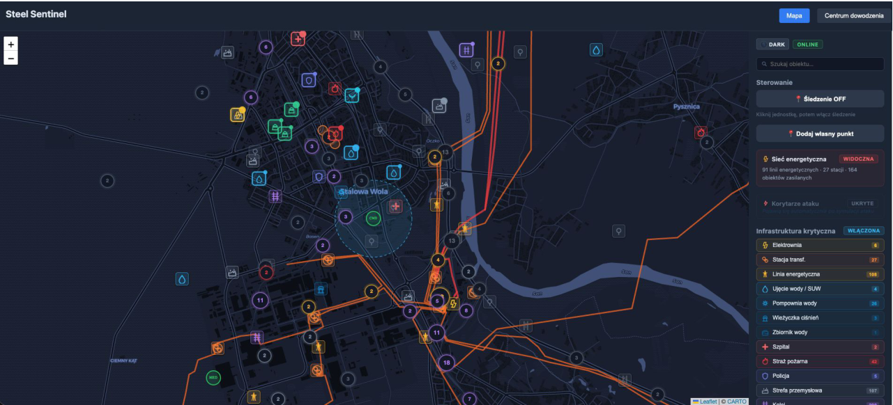
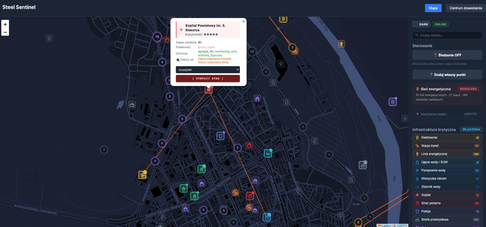
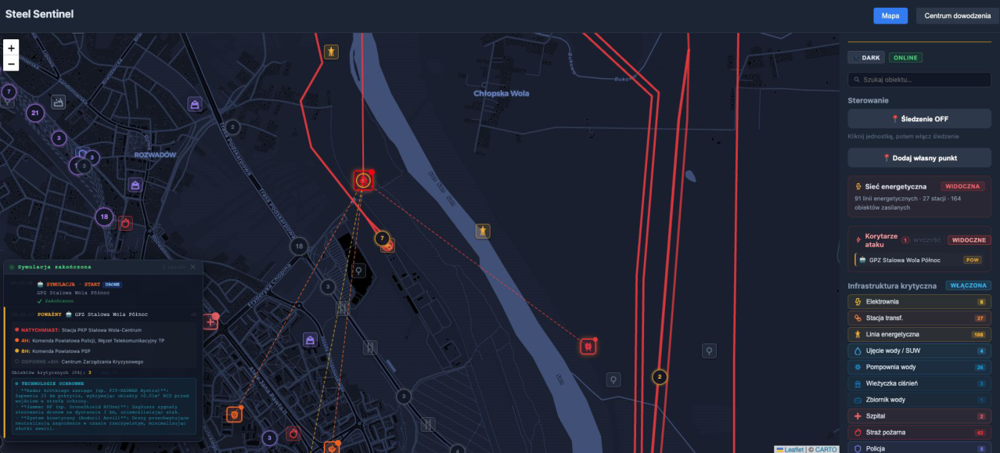
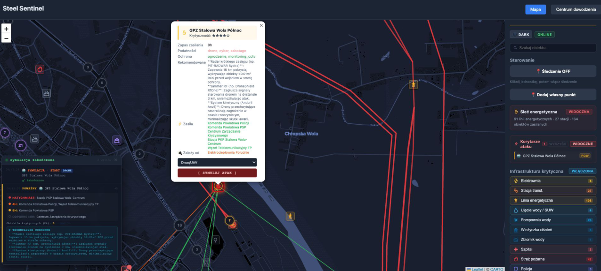
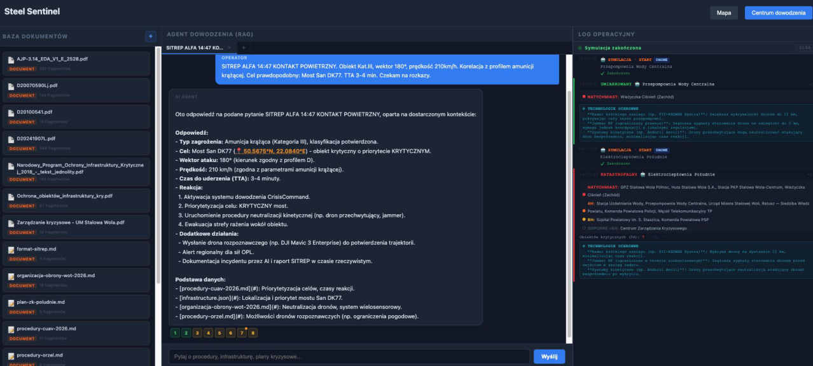
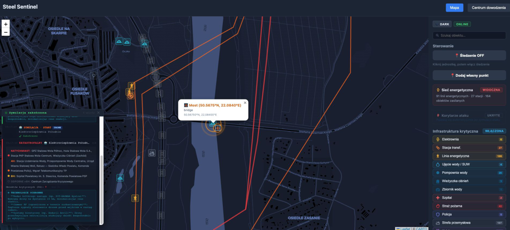

# Steel Sentinel — SpaceShield Hackathon Project

**Steel Sentinel** is a crisis-management and critical-infrastructure analysis system built for the **SpaceShield hackathon**. The project focuses on Stalowa Wola, Poland, and combines an interactive tactical map, infrastructure dependency graphs, attack cascade simulation, satellite/OSM map layers, and a local AI-assisted document analysis panel.

The application is designed as a proof of concept for defence and civil-protection scenarios: operators can inspect critical facilities, simulate attacks, observe cascading infrastructure impact, and query operational documents using a local RAG pipeline.

---

## Table of contents

- [Demo screenshots](#demo-screenshots)
- [Key features](#key-features)
- [Architecture](#architecture)
- [Technology stack](#technology-stack)
- [Project structure](#project-structure)
- [Requirements](#requirements)
- [Setup and running locally](#setup-and-running-locally)
- [Useful API endpoints](#useful-api-endpoints)
- [Data sources](#data-sources)
- [Polska wersja](#steel-sentinel--projekt-hackathonowy-spaceshield)

---

## Demo screenshots

### 1. Critical infrastructure map

Critical infrastructure objects in Stalowa Wola: energy, water, healthcare, transport and industrial facilities.



### 2. Dependency graph and vulnerability zones

The map visualizes dependencies between facilities, for example hospital dependencies on the power plant and water infrastructure.



### 3. Attack cascade simulation

A drone attack simulation against a power facility. Related objects affected by the attack are highlighted with dashed dependency lines, and the attack corridor is displayed on the map.



### 4. Defensive recommendation

The local AI model prepares a defensive recommendation based on the current object defence profile, known vulnerabilities and attack type.



### 5. Command panel with document analysis

The command panel allows operators to query indexed operational documents. The local AI model answers with cited sources and can point to affected objects using map coordinates.



### 6. Jump from document analysis to map

Coordinates returned by the document analysis view can be used to navigate directly to the endangered object on the map.



---

## Key features

- **Interactive tactical map** based on Leaflet.
- **Critical infrastructure layer** for Stalowa Wola, including energy, water, healthcare, transport, administration, communications and industrial objects.
- **Infrastructure dependency graph** showing cascading relationships between facilities.
- **Attack simulation** for scenarios such as drone, missile, sabotage, cyber and chemical threats.
- **Cascade impact analysis** using graph traversal over dependency data.
- **Operational log overlay** showing attack simulations, severity and affected objects.
- **Attack corridor visualization** for simulated threat direction and impact.
- **RAG-based command panel** for querying operational documents and legal/procedural sources.
- **Local AI workflow** using Ollama models, including Bielik for generation and bge-m3 for embeddings.
- **Document upload and indexing** for PDF/Markdown operational files.
- **Map layers**: OpenStreetMap, dark tactical Carto layer and optional Sentinel-2 satellite tiles.
- **Custom map points** persisted by the backend.
- **Offline-oriented design direction**, including locally stored map/satellite tiles and local AI models.

---

## Architecture

The project is split into two main applications:

```text
React + Vite frontend
        |
        | REST API / WebSocket / Vite proxy
        v
FastAPI backend
        |
        |-- infrastructure graph and cascade simulation
        |-- RAG document indexing and querying
        |-- Ollama local LLM / embeddings
        |-- static map and satellite tile serving
        |-- custom operational points
```

### Frontend

The frontend is a React 19 + TypeScript application built with Vite. It contains two main views:

1. **Map view** — operational map, infrastructure markers, dependencies, attack simulation and event log.
2. **Command Center / Documents view** — RAG chat interface, document list, source citations and coordinate-based map navigation.

The map implementation uses Leaflet directly instead of `react-leaflet`, which gives more control over layers, markers, corridors and operational overlays.

### Backend

The backend is a FastAPI service responsible for:

- serving infrastructure and dependency JSON files,
- running attack impact analysis,
- exposing threat-scenario endpoints,
- serving local map/satellite tiles,
- indexing documents into ChromaDB,
- querying local Ollama models,
- handling uploaded operational documents,
- broadcasting moving units over WebSocket.

---

## Technology stack

### Frontend

- React 19
- TypeScript
- Vite
- Leaflet
- leaflet.markercluster
- CSS / inline operational UI styling

### Backend

- Python 3.11+
- FastAPI
- Uvicorn
- ChromaDB
- pypdf
- httpx
- python-dotenv
- Ollama

### AI / RAG

- `SpeakLeash/bielik-minitron-7B-v3.0-instruct:Q4_K_M` — local generative model
- `bge-m3` — embedding model
- ChromaDB — local vector store

### Data / maps

- OpenStreetMap
- Overpass API
- ESA Copernicus / Sentinel-2 optional satellite tiles
- Local critical-infrastructure and dependency JSON datasets
- Operational and legal documents stored in `docs/`

---

## Project structure

```text
.
├── backend/
│   ├── main.py                  # FastAPI app, endpoints, simulation, RAG, AI integration
│   ├── build_rag.py             # Builds ChromaDB index from docs/
│   ├── build_dependencies.py    # Builds dependency data
│   ├── download_map_tiles.py    # Offline map tile helper
│   ├── fetch_critical.py        # Critical infrastructure data helper
│   ├── infrastructure.json      # Critical infrastructure graph
│   ├── dependencies.json        # Dependency graph
│   ├── custom_points.json       # User-added operational points
│   └── pyproject.toml           # Python dependencies for uv
├── frontend/
│   ├── containers/
│   │   ├── MapContainer.tsx
│   │   └── DocumentsContainer.tsx
│   ├── src/
│   │   ├── App.tsx
│   │   ├── components/
│   │   │   ├── LeafletMap.tsx
│   │   │   ├── OperationLogOverlay.tsx
│   │   │   ├── ThreatPanel.tsx
│   │   │   ├── StatusPanel.tsx
│   │   │   └── Controls.tsx
│   │   ├── hooks/
│   │   │   ├── useDependencies.ts
│   │   │   ├── useInfrastructure.ts
│   │   │   ├── useOnlineStatus.ts
│   │   │   └── useWebSocket.ts
│   │   ├── utils/
│   │   │   ├── attackCorridors.ts
│   │   │   └── infraConfig.ts
│   │   └── types.ts
│   ├── package.json
│   └── vite.config.ts
├── docs/
│   ├── images/                  # Screenshots extracted from visualization PDF
│   ├── *.pdf                    # Source documents for RAG
│   └── *.md                     # Operational procedures and demo documents
└── tech_docs/
    └── technical notes
```

---

## Requirements

| Tool | Recommended version | Notes |
|---|---:|---|
| Python | 3.11+ | Backend runtime |
| uv | latest | Python dependency manager |
| Node.js | 18+ | Frontend runtime |
| npm | bundled with Node.js | Frontend dependencies |
| Ollama | latest | Local LLM and embeddings |

Recommended resources:

- **RAM:** at least 8 GB. The Bielik 7B model can use around 5 GB.
- **Disk:** at least 8 GB for Ollama models and local indexes.

---

## Setup and running locally

### 1. Start Ollama and pull AI models

Start Ollama:

```bash
ollama serve
```

In another terminal, download the required models:

```bash
ollama pull SpeakLeash/bielik-minitron-7B-v3.0-instruct:Q4_K_M
ollama pull bge-m3
```

> Keep `ollama serve` running while using the application.

### 2. Start the backend

```bash
cd backend
uv sync
uv run python build_rag.py
uv run uvicorn main:app --reload
```

The backend runs at:

```text
http://localhost:8000
```

### 3. Start the frontend

Open a new terminal:

```bash
cd frontend
npm install
npm run dev
```

The frontend runs at:

```text
http://localhost:5173
```

The Vite dev server proxies `/api`, `/ws`, `/dependencies.json`, `/infrastructure.json` and `/tiles` to the FastAPI backend.

### 4. Open the application

Go to:

```text
http://localhost:5173
```

You should have three active processes:

- `ollama serve`
- `uv run uvicorn main:app --reload` in `backend/`
- `npm run dev` in `frontend/`

---

## Optional Sentinel-2 satellite tiles

The application can use locally served Sentinel-2 satellite tiles. If you have a Copernicus Data Space Ecosystem account, create `backend/.env`:

```env
SH_CLIENT_ID=your-client-id
SH_CLIENT_SECRET=your-client-secret
```

Without these credentials, the app still works with OpenStreetMap and the dark tactical map layer.

---

## Useful API endpoints

| Endpoint | Method | Description |
|---|---|---|
| `/api/critical-infrastructure` | GET | Returns critical infrastructure objects. |
| `/api/impact/{object_id}` | POST | Runs cascade impact analysis for an object. |
| `/api/threat-scenario/{object_id}` | POST | Runs a full threat scenario with AI recommendation. |
| `/api/rag/documents` | GET | Lists indexed RAG documents. |
| `/api/rag/query` | POST | Queries the document knowledge base. |
| `/api/rag/upload` | POST | Uploads a document for indexing. |
| `/api/rag/status` | GET | Returns indexing status. |
| `/api/custom_points` | GET/POST | Lists or adds custom operational points. |
| `/api/custom_points/{point_id}` | DELETE | Deletes a custom point. |
| `/api/tiles/satellite/status` | GET | Returns satellite tile cache/download status. |
| `/api/tiles/satellite/start` | POST | Starts satellite tile download. |
| `/ws/map` | WebSocket | Streams simulated unit positions. |

---

## Data sources

The prototype uses or references:

- OpenStreetMap — https://www.openstreetmap.org
- Overpass API — https://overpass-api.de
- ESA Copernicus / Sentinel-2 — https://dataspace.copernicus.eu
- Polish Crisis Management Act — Dz.U. 2007 nr 89 poz. 590
- Polish Homeland Defence Act — Dz.U. 2022 poz. 2305
- Polish Civil Protection and Civil Defence Act — Dz.U. 2024 poz. 1083
- Regulation on critical infrastructure facilities — Dz.U. 2024 poz. 1473
- NIS2 Directive — Directive (EU) 2022/2555
- Leaflet.js — BSD 2-Clause license

---

# Steel Sentinel — projekt hackathonowy SpaceShield

**Steel Sentinel** to system analizy zagrożeń i ochrony infrastruktury krytycznej przygotowany na hackathon **SpaceShield**. Projekt koncentruje się na Stalowej Woli i łączy interaktywną mapę taktyczną, graf zależności infrastruktury, symulację kaskadowych skutków ataku, warstwy mapowe OSM/satelitarne oraz lokalny panel analizy dokumentów wspierany przez AI.

Aplikacja jest proof of concept dla scenariuszy obronnych i zarządzania kryzysowego: operator może analizować obiekty krytyczne, symulować ataki, obserwować skutki zależności infrastrukturalnych i odpytywać dokumenty operacyjne za pomocą lokalnego pipeline’u RAG.

---

## Spis treści

- [Zrzuty ekranu](#zrzuty-ekranu)
- [Najważniejsze funkcje](#najważniejsze-funkcje)
- [Architektura](#architektura-1)
- [Stack technologiczny](#stack-technologiczny)
- [Struktura projektu](#struktura-projektu)
- [Wymagania](#wymagania)
- [Uruchomienie lokalne](#uruchomienie-lokalne)
- [Przydatne endpointy API](#przydatne-endpointy-api)
- [Źródła danych](#źródła-danych)

---

## Zrzuty ekranu

### 1. Mapa infrastruktury krytycznej

Obiekty infrastruktury krytycznej Stalowej Woli: energia, woda, medycyna, transport i przemysł.


### 2. Graf zależności i strefy podatności

Mapa pokazuje zależności między obiektami, np. zależność szpitala od elektrociepłowni i wodociągów.


### 3. Symulacja ataku i kaskady skutków

Symulacja ataku dronem na obiekt energetyczny. Powiązane obiekty są oznaczane przerywanymi liniami, a korytarz ataku jest widoczny na mapie.


### 4. Rekomendacja obronna

Lokalny model AI przygotowuje rekomendację na podstawie bieżącej obrony obiektu, podatności oraz typu zagrożenia.


### 5. Panel dowodzenia z analizą dokumentów

Panel dowodzenia pozwala odpytywać zaindeksowane dokumenty operacyjne. Model lokalny odpowiada z cytowaniem źródeł i może wskazywać zagrożone obiekty za pomocą współrzędnych.


### 6. Przejście z analizy dokumentów do mapy

Współrzędne zwrócone przez panel dokumentów pozwalają przejść bezpośrednio do zagrożonego obiektu na mapie.


---

## Najważniejsze funkcje

- **Interaktywna mapa taktyczna** oparta o Leaflet.
- **Warstwa infrastruktury krytycznej** Stalowej Woli: energia, woda, medycyna, transport, administracja, komunikacja i przemysł.
- **Graf zależności infrastrukturalnych** pokazujący możliwe kaskady awarii.
- **Symulacja ataku** dla scenariuszy takich jak dron, rakieta, sabotaż, cyberatak i zagrożenie chemiczne.
- **Analiza skutków kaskadowych** oparta na przechodzeniu po grafie zależności.
- **Operacyjny log zdarzeń** pokazujący symulacje, poziom zagrożenia i obiekty dotknięte skutkami ataku.
- **Wizualizacja korytarza ataku** dla symulowanych zagrożeń.
- **Panel RAG / centrum dowodzenia** do odpytywania dokumentów operacyjnych i prawnych.
- **Lokalny workflow AI** z modelami Ollama: Bielik dla generowania odpowiedzi i bge-m3 dla embeddingów.
- **Upload i indeksowanie dokumentów** PDF/Markdown.
- **Warstwy mapowe**: OpenStreetMap, ciemna mapa taktyczna Carto i opcjonalne kafelki Sentinel-2.
- **Własne punkty operacyjne** zapisywane przez backend.
- **Kierunek offline-first**: lokalne modele AI oraz możliwość pracy z lokalnymi kafelkami mapy.

---

## Architektura

Projekt składa się z dwóch głównych aplikacji:

```text
Frontend React + Vite
        |
        | REST API / WebSocket / proxy Vite
        v
Backend FastAPI
        |
        |-- graf infrastruktury i symulacja kaskady
        |-- indeksowanie i odpytywanie dokumentów RAG
        |-- lokalny model LLM / embeddingi przez Ollama
        |-- serwowanie lokalnych kafelków mapowych i satelitarnych
        |-- własne punkty operacyjne
```

### Frontend

Frontend to aplikacja React 19 + TypeScript zbudowana na Vite. Ma dwa główne widoki:

1. **Mapa** — mapa operacyjna, markery infrastruktury, zależności, symulacja ataku i log zdarzeń.
2. **Centrum dowodzenia / dokumenty** — czat RAG, lista dokumentów, cytowanie źródeł i przejście na mapę po współrzędnych.

Mapa korzysta bezpośrednio z Leafleta, bez `react-leaflet`, co daje większą kontrolę nad warstwami, markerami, korytarzami ataku i nakładkami operacyjnymi.

### Backend

Backend to usługa FastAPI odpowiedzialna za:

- serwowanie danych infrastruktury i zależności,
- analizę skutków ataku,
- endpointy scenariuszy zagrożeń,
- serwowanie lokalnych kafelków mapowych/satelitarnych,
- indeksowanie dokumentów do ChromaDB,
- komunikację z lokalnymi modelami Ollama,
- upload dokumentów operacyjnych,
- wysyłanie pozycji jednostek przez WebSocket.

---

## Stack technologiczny

### Frontend

- React 19
- TypeScript
- Vite
- Leaflet
- leaflet.markercluster
- CSS / stylowanie interfejsu operacyjnego

### Backend

- Python 3.11+
- FastAPI
- Uvicorn
- ChromaDB
- pypdf
- httpx
- python-dotenv
- Ollama

### AI / RAG

- `SpeakLeash/bielik-minitron-7B-v3.0-instruct:Q4_K_M` — lokalny model generatywny
- `bge-m3` — model embeddingów
- ChromaDB — lokalna baza wektorowa

### Dane i mapy

- OpenStreetMap
- Overpass API
- ESA Copernicus / opcjonalne kafelki Sentinel-2
- lokalne zbiory JSON z infrastrukturą i zależnościami
- dokumenty operacyjne i prawne w katalogu `docs/`

---

## Struktura projektu

```text
.
├── backend/
│   ├── main.py                  # FastAPI, endpointy, symulacja, RAG, integracja AI
│   ├── build_rag.py             # Budowanie indeksu ChromaDB z docs/
│   ├── build_dependencies.py    # Budowanie danych zależności
│   ├── download_map_tiles.py    # Pomocniczy skrypt do kafelków offline
│   ├── fetch_critical.py        # Pomocniczy skrypt dla infrastruktury krytycznej
│   ├── infrastructure.json      # Graf infrastruktury krytycznej
│   ├── dependencies.json        # Graf zależności
│   ├── custom_points.json       # Własne punkty operacyjne
│   └── pyproject.toml           # Zależności Python dla uv
├── frontend/
│   ├── containers/
│   │   ├── MapContainer.tsx
│   │   └── DocumentsContainer.tsx
│   ├── src/
│   │   ├── App.tsx
│   │   ├── components/
│   │   │   ├── LeafletMap.tsx
│   │   │   ├── OperationLogOverlay.tsx
│   │   │   ├── ThreatPanel.tsx
│   │   │   ├── StatusPanel.tsx
│   │   │   └── Controls.tsx
│   │   ├── hooks/
│   │   │   ├── useDependencies.ts
│   │   │   ├── useInfrastructure.ts
│   │   │   ├── useOnlineStatus.ts
│   │   │   └── useWebSocket.ts
│   │   ├── utils/
│   │   │   ├── attackCorridors.ts
│   │   │   └── infraConfig.ts
│   │   └── types.ts
│   ├── package.json
│   └── vite.config.ts
├── docs/
│   ├── images/                  # Zrzuty ekranu z PDF-a wizualizacji
│   ├── *.pdf                    # Dokumenty źródłowe dla RAG
│   └── *.md                     # Procedury i dokumenty demonstracyjne
└── tech_docs/
    └── notatki techniczne
```

---

## Wymagania

| Narzędzie | Rekomendowana wersja | Uwagi |
|---|---:|---|
| Python | 3.11+ | Backend |
| uv | najnowsza | Zarządzanie zależnościami Python |
| Node.js | 18+ | Frontend |
| npm | razem z Node.js | Zależności frontendowe |
| Ollama | najnowsza | Lokalny LLM i embeddingi |

Zalecane zasoby:

- **RAM:** minimum 8 GB. Model Bielik 7B może zajmować ok. 5 GB.
- **Dysk:** minimum 8 GB na modele Ollama i lokalne indeksy.

---

## Uruchomienie lokalne

### 1. Uruchom Ollama i pobierz modele AI

Uruchom Ollama:

```bash
ollama serve
```

W drugim terminalu pobierz wymagane modele:

```bash
ollama pull SpeakLeash/bielik-minitron-7B-v3.0-instruct:Q4_K_M
ollama pull bge-m3
```

> `ollama serve` musi działać przez cały czas korzystania z aplikacji.

### 2. Uruchom backend

```bash
cd backend
uv sync
uv run python build_rag.py
uv run uvicorn main:app --reload
```

Backend działa pod adresem:

```text
http://localhost:8000
```

### 3. Uruchom frontend

W nowym terminalu:

```bash
cd frontend
npm install
npm run dev
```

Frontend działa pod adresem:

```text
http://localhost:5173
```

Serwer deweloperski Vite przekierowuje `/api`, `/ws`, `/dependencies.json`, `/infrastructure.json` i `/tiles` do backendu FastAPI.

### 4. Otwórz aplikację

Przejdź w przeglądarce do:

```text
http://localhost:5173
```

Powinny działać trzy procesy:

- `ollama serve`
- `uv run uvicorn main:app --reload` w katalogu `backend/`
- `npm run dev` w katalogu `frontend/`

---

## Opcjonalne kafelki satelitarne Sentinel-2

Aplikacja może korzystać z lokalnie serwowanych kafelków Sentinel-2. Jeśli masz konto w Copernicus Data Space Ecosystem, utwórz plik `backend/.env`:

```env
SH_CLIENT_ID=twoj-client-id
SH_CLIENT_SECRET=twoj-client-secret
```

Bez tych danych aplikacja nadal działa z OpenStreetMap i ciemną warstwą taktyczną.

---

## Przydatne endpointy API

| Endpoint | Metoda | Opis |
|---|---|---|
| `/api/critical-infrastructure` | GET | Zwraca obiekty infrastruktury krytycznej. |
| `/api/impact/{object_id}` | POST | Uruchamia analizę skutków kaskadowych. |
| `/api/threat-scenario/{object_id}` | POST | Uruchamia pełny scenariusz zagrożenia z rekomendacją AI. |
| `/api/rag/documents` | GET | Zwraca listę zaindeksowanych dokumentów RAG. |
| `/api/rag/query` | POST | Odpytuje bazę wiedzy dokumentów. |
| `/api/rag/upload` | POST | Wgrywa dokument do indeksowania. |
| `/api/rag/status` | GET | Zwraca status indeksowania. |
| `/api/custom_points` | GET/POST | Lista lub dodawanie własnych punktów operacyjnych. |
| `/api/custom_points/{point_id}` | DELETE | Usuwa własny punkt. |
| `/api/tiles/satellite/status` | GET | Zwraca status cache/pobierania kafelków satelitarnych. |
| `/api/tiles/satellite/start` | POST | Uruchamia pobieranie kafelków satelitarnych. |
| `/ws/map` | WebSocket | Strumień symulowanych pozycji jednostek. |

---

## Źródła danych

Projekt wykorzystuje lub odnosi się do:

- OpenStreetMap — https://www.openstreetmap.org
- Overpass API — https://overpass-api.de
- ESA Copernicus / Sentinel-2 — https://dataspace.copernicus.eu
- Ustawa o zarządzaniu kryzysowym — Dz.U. 2007 nr 89 poz. 590
- Ustawa o obronie Ojczyzny — Dz.U. 2022 poz. 2305
- Ustawa o ochronie ludności i obronie cywilnej — Dz.U. 2024 poz. 1083
- Rozporządzenie w sprawie obiektów infrastruktury krytycznej — Dz.U. 2024 poz. 1473
- Dyrektywa NIS2 — Dyrektywa (UE) 2022/2555
- Leaflet.js — licencja BSD 2-Clause
